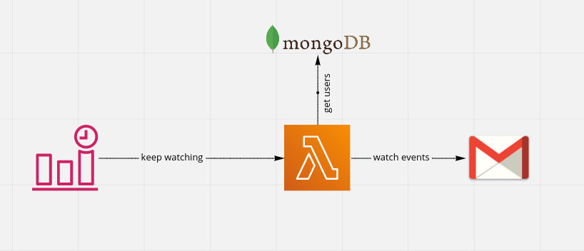

  

  
<strong>A Weekly Newsletter Email service to unclutter your inbox</strong>

  

## What is Summail

This project consolidates your email subscriptions into a single weekly summary email.

It was created as a challenge at [codementor.io](https://www.codementor.io/projects/web/weekly-newsletter-summary-email-atx32ild7k) to practice serverless development with AWS.

Users need to register to newsletters with a suffix `+newsletter` in order to have only these e-mails selected. For example: `user+newsletter@gmail.com`.

## Architecture

The architecture decisions were documented in Notion and Miro. I like to draw the possibilities and take notes of the possible consequences of each approach.

### Authentication

First, we need to authorize the user through Google and retrieve the access token to make future requests to the Gmail API. Because the access token can expire, it is better to store the refresh token.

MongoDB was used as our database for the only reason I was working with it at my current job. A relational database could also be used in its place.

### Storage of Emails

To get the user's emails and store it in a database, the simpler approach would be to keep polling the Gmail API for all the messages. However, this wouldn't scale, so I decided to connect to the [Gmail Push Notification](https://developers.google.com/gmail/api/guides/push) using Google Cloud PubSub.

A SQS Queue and also a Dead-Letter were also set up to handle notifications for multiple users and to increase reliability in case of failures.

### Keeping the Subscription Alive

We have to keep notifying the Gmail API that we still want to receive events for our users. So, a cron job was set up to run everyday with CloudWatch Events.

### Sending the Newsletters

Every user might receive dozens of newsletters during a week, so we want to grab these emails per user and send them to a queue. These aggregated messages will then be processed by another lambda that will also send them using AWS SES.

## License

[MIT](LICENSE) © André Brandão
